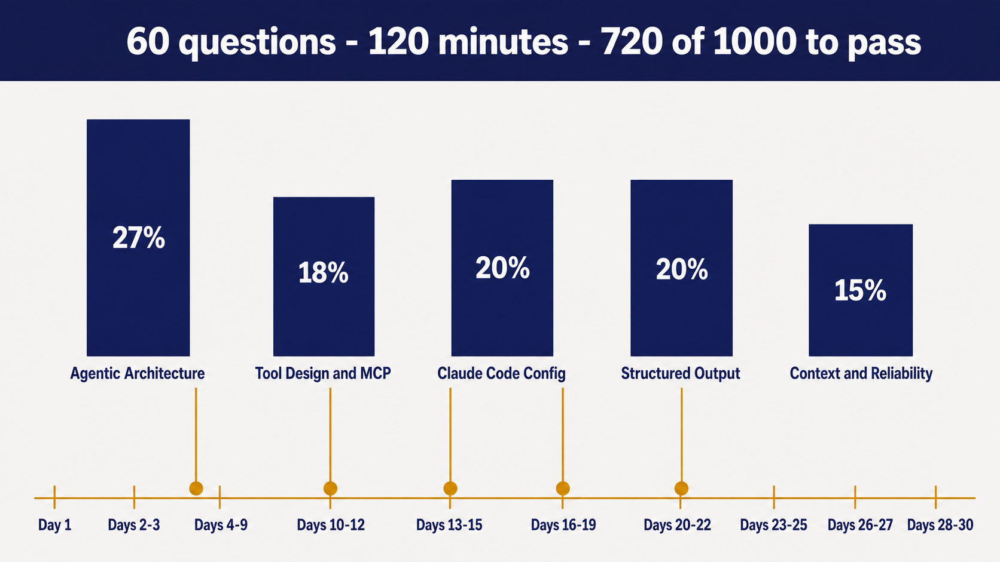
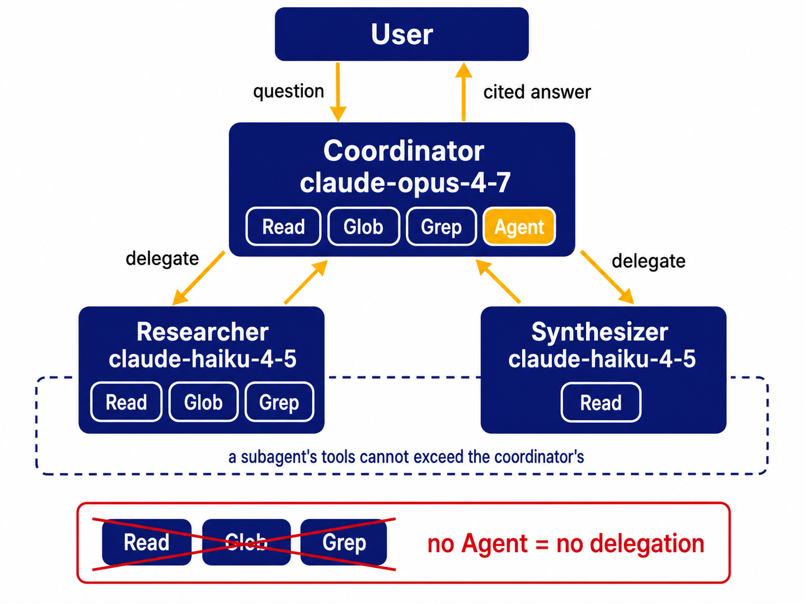
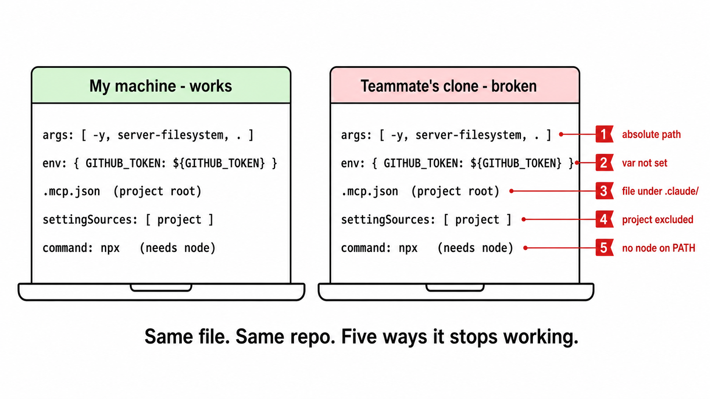

# The CCA-F Prep Kit

**Walk into the Claude Certified Architect Foundations exam in thirty days with
a mock score you can trust and eight build projects you can defend.**

Companion repository to *Claude Certified Architect Foundations Playbook*, from
[youcanbuildthings.com](https://youcanbuildthings.com).

Two things live here. A **study half** (a thirty-day plan, five one-page cheat
sheets, sixty practice questions and a scorer) that works the second you clone
it, with no account, no API key and no internet. And a **code half**: eight
small Python projects from Chapters 4 through 10, which do call Claude and do
need your own key. "MCP" is a plug standard for giving an AI tool access;
"structured output" means making the model return JSON that always matches a
shape you chose; "silent failure" is an answer that looks right and isn't. You
build one small thing for each. Start with the study half below; the code half
is in `chapters/`.

## Start here

**"I just got the book and I don't know where I stand."**

```
git clone https://github.com/regardo911/cca-f-prep-kit && cd cca-f-prep-kit
python3 study/score_mock.py --diagnostic
```

Five questions, one per domain. It asks, you answer, and it tells you which of
the five domains is your weakest and which chapter folder fixes it. Thirty
seconds, and it is the first thing Chapter 1 asks you to do.

**"I've worked through the chapters and want to know if I'm ready."**

```
git clone https://github.com/regardo911/cca-f-prep-kit && cd cca-f-prep-kit
python3 study/score_mock.py --template > my-answers.txt
# sit study/mock-exam.md in one two-hour block, fill in my-answers.txt
python3 study/score_mock.py my-answers.txt
```

Sixty questions, weighted 16/11/12/12/9 to match the real blueprint. You get a
score per domain and the book's own go/no-go rule: 80% or better, book the date.

**"I just want the eight build projects."**

```
git clone https://github.com/regardo911/cca-f-prep-kit && cd cca-f-prep-kit
```

Then the copy table.

## The copy table

Fork this, copy these files into your own `cca-f-prep`, ship them as you go.
Every file listed here exists in this repo, and every file this repo ships is
listed here or in the chapter map below.

| Ch | Take this | Put it here in your `cca-f-prep` |
|---|---|---|
| 4 | `chapters/04-agentic-architecture/multi_agent_starter.py` | `multi_agent_starter/` |
| 4 | `chapters/04-agentic-architecture/sample-project/` | `multi_agent_starter/sample-project/` |
| 5 | `chapters/05-orchestration/multi_agent_batch.py` | `multi_agent_starter/` |
| 6 | `chapters/06-mcp-portability/mcp_starter/` | `mcp_starter/` |
| 6 | `chapters/06-mcp-portability/mcp_starter/ci-mcp-portability.yml` | `.github/workflows/` |
| 7 | `chapters/07-claude-code-config/claude_config_starter/` | `claude_config_starter/`, then the five `cp` lines in its `VERIFY.md` |
| 8 | `chapters/08-structured-output/extractor.py` + `samples/` + `failure_modes.md` | `extractor/` |
| 9 | `chapters/09-silent-failures/silent_failure_detector.py` + `samples/` | `silent_failure_detector/` |
| 10 | `chapters/10-trust-and-safety/` | `trust_enforcement_middleware/` |
| 11 | `chapters/11-cert-positioning/` | wherever you keep your notes; the templates are for LinkedIn |
| n/a | `shared/harmlessness_screen.py` | `harmlessness_screen/` |
| n/a | `shared/fallback_wrapper.py` | `fallback_wrapper/` |

Those are the eight the appendix names: `multi_agent_starter`, `mcp_starter`,
`claude_config_starter`, `extractor`, `silent_failure_detector`,
`trust_enforcement_middleware`, `harmlessness_screen`, `fallback_wrapper`.
`multi_agent_batch.py` belongs to the first one, not to a ninth.

The book tells you to create your own repo at
`github.com/<your-handle>/cca-f-prep`, and that instruction stands. This repo is
the fork source that feeds it. Your work goes in your repo, under your name,
linked from your LinkedIn.

## The chapter map

| Chapter | What you build | The command | What success looks like |
|---|---|---|---|
| [4 Agentic architecture](chapters/04-agentic-architecture) | coordinator + two subagents, with the tool-scope fence | `python3 multi_agent_starter.py` | every cited file exists and every line range maps to real content |
| [5 Orchestration](chapters/05-orchestration) | the same coordinator, batched | `python3 multi_agent_batch.py` | a batch id, and half the synchronous cost on your console |
| [6 MCP portability](chapters/06-mcp-portability) | three MCP tools that survive a clone | `python3 check_portability.py` | all five gotchas pass, on a bare clone, keyless |
| [7 Claude Code config](chapters/07-claude-code-config) | three CLAUDE.md scopes, `/recap`, one hook | see `VERIFY.md` | Project says 4-space, Local says 2-space, the agent says 2-space |
| [8 Structured output](chapters/08-structured-output) | a five-field extractor over twenty trials | `python3 extractor.py` | every call schema-valid; the validators reject the five awkward samples |
| [9 Silent failures](chapters/09-silent-failures) | three-mechanism detector | `python3 silent_failure_detector.py --demo-regression` | two planted drifts caught, keyless |
| [10 Trust and safety](chapters/10-trust-and-safety) | operator / user / system tiers in code | `python3 trust_enforcement_middleware.py --check` | A refuses, B succeeds, C refuses |
| [11 Cert positioning](chapters/11-cert-positioning) | LinkedIn paragraph and five outreach DMs | none, this one is typing | one substantive reply in seven days |

Chapters 1, 2, 3 and 12 have no folder. Their artifacts are the diagnostic, the
Access Path Worksheet, the five judgment patterns and the mock, and those live
in `study/`, because you reach for them out of order and all month long.

| In `study/` | |
|---|---|
| [30-day-plan.md](study/30-day-plan.md) | the day map, with the folder that serves each block |
| [diagnostic.md](study/diagnostic.md) | Chapter 1's five questions, plus your baseline page |
| [access-path-worksheet.md](study/access-path-worksheet.md) | which of the four doors into the exam is yours |
| [five-judgment-patterns.md](study/five-judgment-patterns.md) | the card, the traps, and a blank to fill from memory |
| [cheat-sheets/](study/cheat-sheets) | five one-page domain sheets, print them |
| [mock-exam.md](study/mock-exam.md) · [mock-exam-answer-key.md](study/mock-exam-answer-key.md) | sixty questions and the reasoning for each |
| [score_mock.py](study/score_mock.py) · [answer-key.json](study/answer-key.json) | the scorer and the key it reads |
| [scoresheet.md](study/scoresheet.md) | score by hand instead, and the go/no-go rule |
| [rehearsal-stems.md](study/rehearsal-stems.md) | twenty-eight stems from the chapters, answers at the bottom |
| [glossary.md](study/glossary.md) | eighteen terms |
| [academy-crosswalk.md](study/academy-crosswalk.md) | which free Academy course maps to which chapter |
| [typescript-crosswalk.md](study/typescript-crosswalk.md) | the six SDK calls, Python beside TypeScript |
| [exam-day.md](study/exam-day.md) | night before, morning of, and what to do if you fail by four |

## What it needs to run

**`study/` needs nothing.** Python 3.10 or newer, and that is the whole list. No
key, no account, no network. `score_mock.py` is standard library only.

**`chapters/` needs your own `ANTHROPIC_API_KEY`** and spends your own credit.

```
python3 -m venv .venv && source .venv/bin/activate
pip install claude-agent-sdk anthropic pydantic mcp pyyaml
export ANTHROPIC_API_KEY="sk-ant-..."
```

Five packages. The book installs two of them and imports the other three
without ever saying so, which is an `ImportError` waiting for you at Chapter 5.
No versions are pinned here, because the book pins exactly one dependency in its
entirety and inventing the rest would be worse than leaving them out. Python
3.10 is the floor: the code uses `str | None` and `list[str]`. Chapter 6 also
wants Node 20 for two npm MCP servers, and Chapter 7 wants Claude Code.

**Roughly what a run costs**, estimated from the published per-million-token
rates in the book (Opus 4.7 at $5 in / $25 out, Haiku 4.5 at $1 / $5) and not
read off anyone's bill:

| | Estimate |
|---|---|
| `extractor.py`, all twenty trials | ~$0.30, the most expensive thing here |
| `multi_agent_starter.py`, one run | a few cents |
| `harmlessness_screen.py`, three stems | fractions of a cent |
| the whole code layer, once, end to end | well under a dollar |

Your console has the real number. Nothing in this repo reads it, and nothing
here prints a dollar figure as if it had.

**What is not tested here.** The eight build projects are runnable *with your
key* and are **not** tested in this repo or in its CI. A test that pretended to
exercise a live API call would be testing the pretence. What CI runs is the
keyless surface: the scorer's arithmetic, the shuffle's round-trip, the five
portability assertions, the Pydantic models, the operator policy, and a link
check.

## How the pieces fit

<p align="center">
  
</p>

Domain 1 is more than a quarter of the exam, so Chapters 4 and 5 get six days
and the two biggest folders. Domain 5 is the smallest and gets three, and it is
where close-fail candidates lose, because everyone budgets by weight.

### Chapter 4: the shape everything else hangs off

<p align="center">
  
</p>

The Researcher gathers evidence. The Synthesizer, which cannot search, can only
cite what the Researcher found. Drop `"Agent"` from the coordinator's list and
the whole thing quietly stops delegating. One string, and it is the single
most-graded detail in Domain 1.

### Chapter 6: the same file, two machines

<p align="center">
  
</p>

`check_portability.py` asserts four of those five from the files alone, with no
key and no network. The fifth can only see your own PATH, and it says so.

### Chapter 10: the argument is a size comparison

<p align="center">
  
</p>

### Chapter 3: the ten-second path

<p align="center">
  
</p>

Print it. The book tells you to tape it to a wall, and the reason is that you
use it under a two-minute clock, not at a desk.

## Why it works the way it does, and where the book is wrong

Both live in [GOTCHAS.md](GOTCHAS.md): the five places the printed code and the
printed prose disagree and which one this repo followed, why the mock's answer
letters differ from the book's, and the things this repo deliberately does not
do. It is also where the things that actually bit during the build are written
down, with the command output that proves each one.

## Testing

```
python3 tests/run_all.py
```

Offline, keyless, and no test framework. The book's own CI runs plain
`python tests/*.py` and teaches no runner, so neither does this. Four files,
sixty-four checks. `.github/workflows/ci.yml` runs the same four on push, with
Python 3.10 and Node 20 and no Anthropic key anywhere.

## Disclaimers

Educational software, provided as is, with no warranty. MIT licensed.

**Not affiliated with, endorsed by, or produced by Anthropic.** The practice
questions here are original scenario drills written from public sources:
Anthropic's published exam blueprint, the Academy catalogue, and public
test-taker discussion. They are **not** real exam items and nobody here has seen
one.

**The exam can change.** The domain weights, the $99 fee, the format and the
proctoring arrangements are what the book verified at the time of writing.
Confirm the current details in the exam portal before you rely on any of them.
Anthropic has not published a recertification policy or a retake wait period; if
you read a specific number for either, somebody guessed it.

## License

MIT. See [LICENSE](LICENSE). Use it, fork it, ship your version of it. It is
study material for an exam, which is the least proprietary thing there is.
